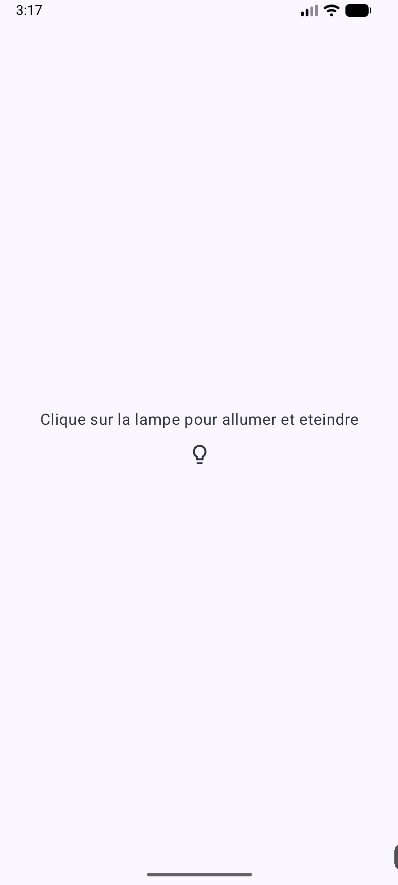
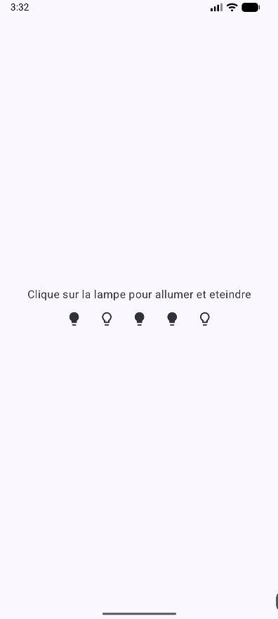
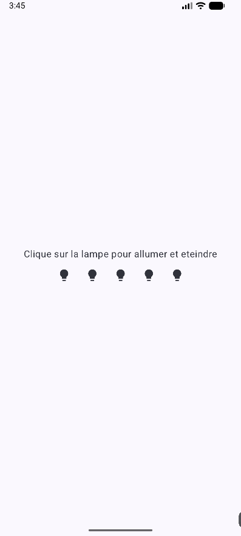
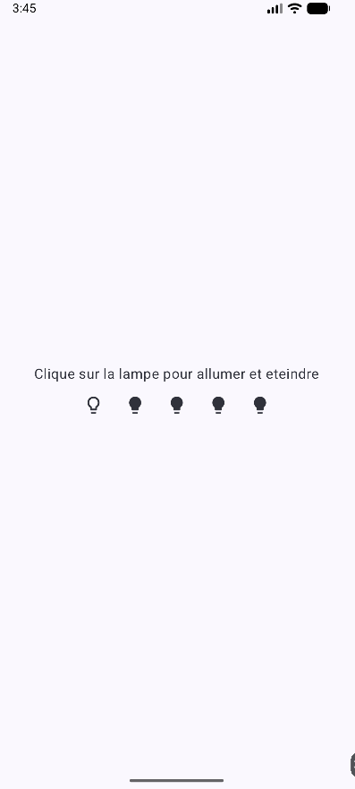
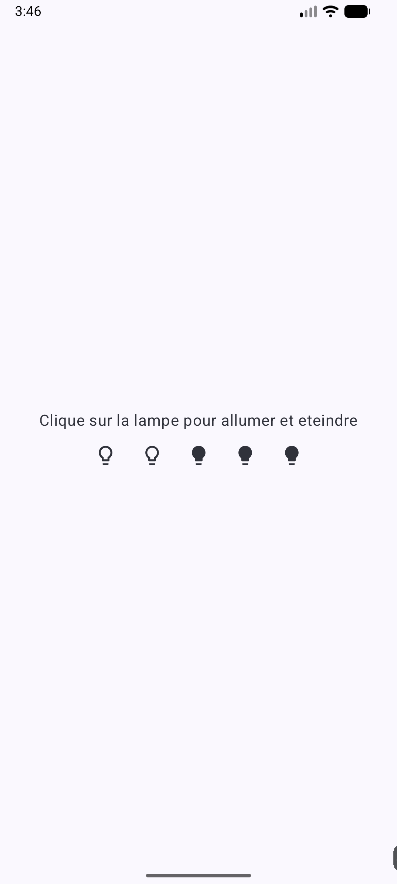
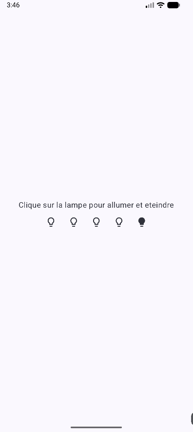

# Etat i18n logo 🌐

<Row>

<Column>

:::tip Avant la séance (2h)

Consulter la **[recette sur la gestion de l'état](../recettes/gestion-etat)**.

Consulter la **[recette sur le multilingue](../recettes/multilingue)**.

Consulter la **[recette sur les logo](../recettes/logo)**.

:::

</Column>

<Column>

:::info Multilingue, locales

On parlera de stratégie pour déterminer quelle sera la locale par défaut, comment fournir une traduction complète (français) ou une traduction partielle (québécois).

:::

</Column>

</Row>

:::note Exercices de la semaine

## Exercice Multilingue

Vous devez faire une application avec un titre (dans le TopBar) et un Text dans l'activité.

- En anglais, le titre est "SupaDupa app" et le Text est "expensive"
- En français, le titre est "App en français" et le Text est "cher"
- En québécois, le titre est "App en français" et le Text est "dispendieux"

Votre application doit avoir un logo différent de celui par défaut.

## Exercice Logo

Vous devez ajouter le logo [suivant](_13.2-multilingue/logo.jpeg) à votre projet ci-dessus.

## Exercices Etats

### Compteur

<Row>

<Column>
Prévois l'affichage d'un compteur avec un bouton pour incrémenter et un bouton pour décrémenter ce compteur. 

Une fois l'affichage obtenu et les boutons fonctionnels, isole le bouton dans une fonction ayant pour signature : 
```kotlin
@Composable
fun Bouton(
    texteAffiché : String,           // Texte à afficher dans le bouton
    changerCompteur : () -> Unit,    // Fonction permettant la modification du compteur
    modifier : Modifier = Modifier   // Le Modifier à appliquer au bouton
)
```
</Column>

<Column>
[](_13.2-multilingue/etat_compteur.png)
</Column>

</Row>

### Allume et éteint

<Row>
<Column>
Fais une application qui permet d'allumer et d'éteindre une lampe.
</Column>
<Column>
<Row>
<Column>
[](_13.2-multilingue/allume.png)
</Column>
<Column>
[](_13.2-multilingue/eteint.png)
</Column>
</Row>
</Column>
</Row>

<Row>
<Column>
Mets en place une rangée de lampes que tu vas pouvoir allumer ou eteindre individuellement
</Column>
<Column>
[](_13.2-multilingue/rangeeLampes.png)
</Column>
</Row>

<Row>
<Column>
Dernière étape : fais en sorte que lorsque tu cliques sur la lampe la plus à gauche, seulement cette lampe s'allume, lorsque tu cliques sur la deuxième lampe à gauche, les deux premières s'allument, etc...

Prévois également une possibilité d'éteindre toutes les ampoules.
</Column>

<Column>
<Row>
<Column>
[](_13.2-multilingue/toutEteint.png)
</Column>
<Column>
[](_13.2-multilingue/gaucheAllume.png)
</Column>
</Row>

<Row>
<Column>
[](_13.2-multilingue/gauche2Alllume.png)
</Column>
<Column>
[](_13.2-multilingue/gauche4Allume.png)
</Column>
</Row>
</Column>

</Row>
:::
