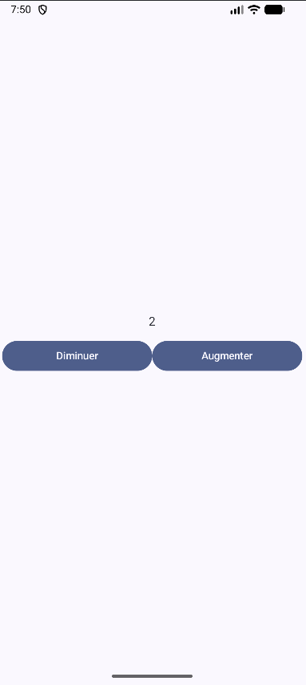

# Etat i18n logo 🌐

<Row>

<Column>

:::tip Avant la séance (2h)

Consulter la **[recette sur la gestion de l'état](../recettes/gestion-etat)**.

Consulter la **[recette sur le multilingue](../recettes/multilingue)**.

Consulter la **[recette sur les logo](../recettes/logo)**.

:::

</Column>

<Column>

:::info Multilingue, locales

On parlera de stratégie pour déterminer quelle sera la locale par défaut, comment fournir une traduction complète (français) ou une traduction partielle (québécois).

:::

</Column>

</Row>

:::note Exercices de la semaine

## Exercice Multilingue

Vous devez faire une application avec un titre (dans le TopBar) et un Text dans l'activité.

- En anglais, le titre est "SupaDupa app" et le Text est "expensive"
- En français, le titre est "App en français" et le Text est "cher"
- En québécois, le titre est "App en français" et le Text est "dispendieux"

Votre application doit avoir un logo différent de celui par défaut.

## Exercice Logo

Vous devez ajouter le logo [suivant](_13.2-multilingue/logo.jpeg) à votre projet ci-dessus.

## Exercices Etats

### Compteur

Prévois l'affichage d'un compteur avec un bouton pour incrémenter et un bouton pour décrémenter ce compteur. 

[](_13.2-multilingue/etat_compteur.png)

Une fois l'affichage obtenu et les boutons fonctionnels, isole le bouton dans une fonction ayant pour signature : 
```kotlin
@Composable
fun Bouton(
    texteAffiché : String,           // Texte à afficher dans le bouton
    changerCompteur : () -> Unit,    // Fonction permettant la modification du compteur
    modifier : Modifier = Modifier   // Le Modifier à appliquer au bouton
)
```

### Allume et éteint

:::
